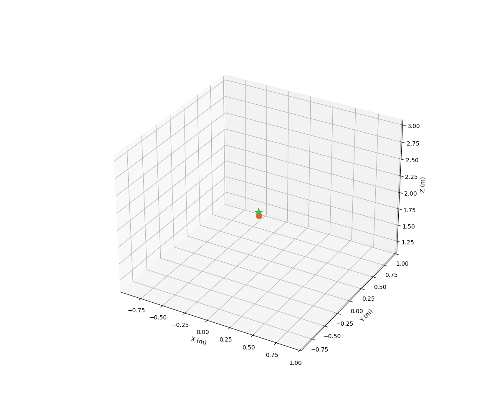
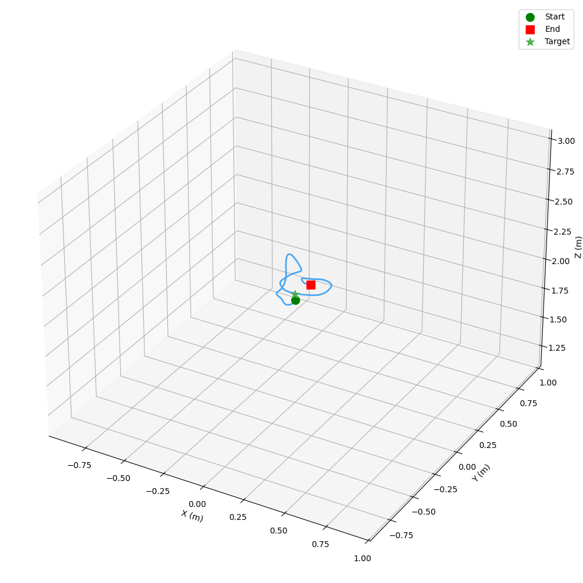
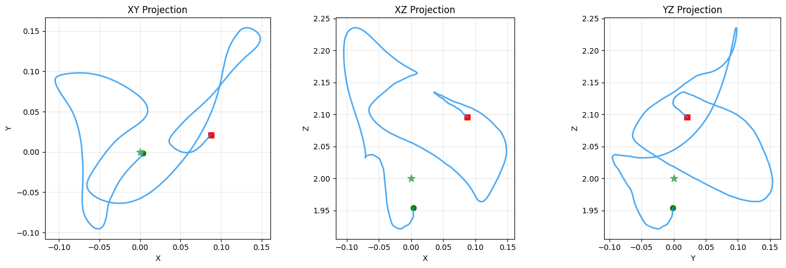
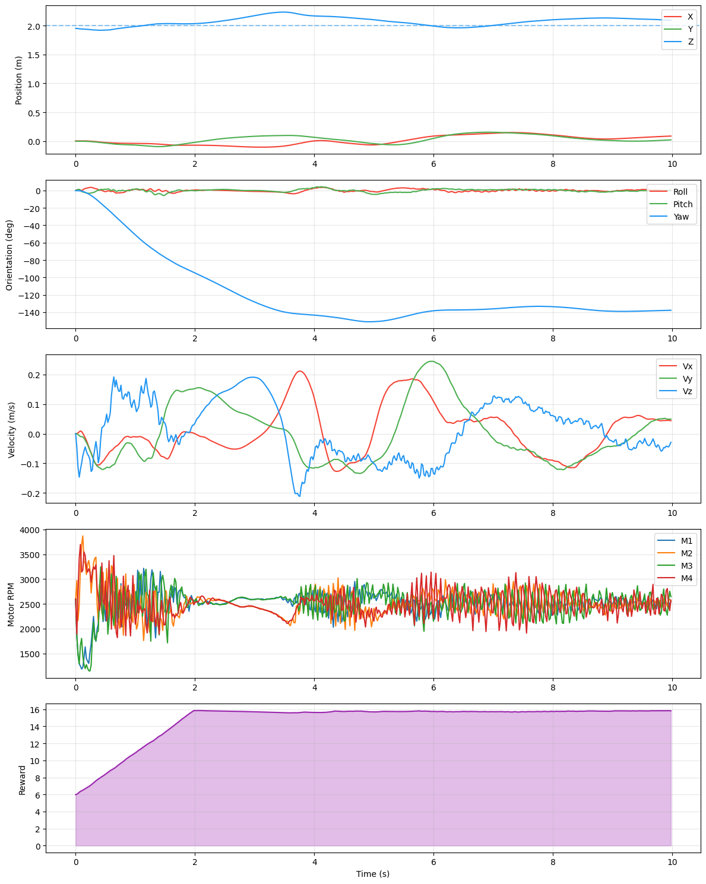
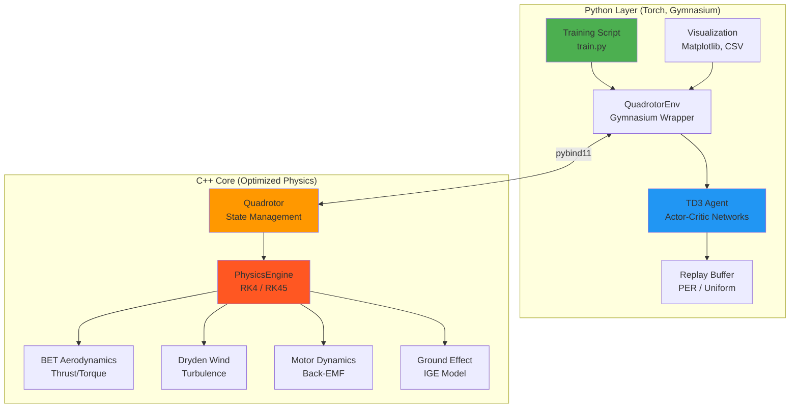

# HelixDrone-HybridCore

<div align="center">



**A State-of-the-Art Quadrotor Physics Simulation Framework with Deep Reinforcement Learning**

[](https://isocpp.org/)
[](https://www.python.org/)
[](https://en.wikipedia.org/wiki/Runge%E2%80%93Kutta%E2%80%93Fehlberg_method)
[](https://arxiv.org/abs/1802.09477)
[](LICENSE)

*mathematically rigorous flight dynamics and modern Deep Reinforcement Learning*

[Features](#key-features) •
[Installation](#installation) •
[Documentation](#documentation) •
[Usage](#usage) •
[Theory](#mathematical-foundations) •
[Performance](#performance-and-benchmarks) •
[Citation](#citation)

</div>

---

## Table of Contents

- [Overview](#overview)
- [Key Features](#key-features)
- [Visual Demonstrations](#visual-demonstrations)
- [Mathematical Foundations](#mathematical-foundations)
  - [Rigid Body Dynamics](#1-rigid-body-dynamics-6dof-newton-euler)
  - [Blade Element Theory](#2-blade-element-theory-bet---advanced-rotor-aerodynamics)
  - [Ground Effect Modeling](#3-ground-effect-modeling)
  - [Dryden Wind Turbulence](#4-dryden-wind-turbulence-model)
  - [Motor & Battery Dynamics](#5-motor--battery-dynamics)
  - [Numerical Integration](#6-numerical-integration-methods)
  - [Reinforcement Learning Formulation](#7-reinforcement-learning-formulation)
- [Architecture](#system-architecture)
- [Installation](#installation)
- [Usage](#usage)
  - [Basic Training](#basic-training-td3)
  - [Advanced Configuration](#advanced-configuration)
  - [Generating Replays](#generating-replays--visualizations)
- [Configuration Reference](#configuration-reference)
- [API Documentation](#api-documentation)
- [Performance and Benchmarks](#performance-and-benchmarks)
- [Troubleshooting](#troubleshooting)
- [FAQ](#frequently-asked-questions)
- [Contributing](#contributing)
- [Citation](#citation)
- [License](#license)

---

## Overview

**HelixDrone-HybridCore** is a cutting-edge quadrotor simulation framework engineered for high-performance Deep Reinforcement Learning research. It combines the computational efficiency of a C++17 physics engine with the flexibility of Python-based RL training, enabling researchers and engineers to train sophisticated flight control policies at unprecedented speeds.

### What Makes HelixDrone Unique?

1. **Hybrid C++/Python Architecture**: Physics simulations run at 5000+ steps/second in optimized C++ (`drone_core`), while agent training leverages PyTorch's GPU acceleration.

2. **Academic-Grade Physics**: Implements Blade Element Theory, Dryden wind turbulence, ground effect, motor/battery dynamics, and adaptive RK45 integration—far surpassing simple quadratic thrust models.

3. **Production-Ready RL**: Fully compatible with Gymnasium API, featuring Twin Delayed DDPG (TD3), Prioritized Experience Replay (PER), curriculum learning, and domain randomization.

4. **Research & Industry Applications**:
   - **Academic Research**: Validate novel control algorithms with realistic physics.
   - **Sim-to-Real Transfer**: Train policies robust to wind, sensor noise, and motor lag.
   - **UAV Development**: Rapid prototyping of autonomous flight behaviors.

---

## Key Features

### Physics Engine (C++ Core)

- **6-DOF Rigid Body Dynamics**: Full quaternion-based orientation tracking with Newton-Euler equations.
- **Blade Element Theory (BET)**: Calculates rotor thrust/torque by integrating aerodynamic forces along blade elements.
- **Runge-Kutta-Fehlberg (RK45)**: Adaptive step integration with automatic error control for stiff dynamics.
- **Dryden Wind Model**: Stochastic turbulence with altitude-dependent power spectral density.
- **Ground Effect**: Dynamic thrust augmentation near surfaces (In-Ground Effect).
- **Motor Dynamics**: Back-EMF, coil resistance, torque constants, and rotor inertia.
- **Battery Simulation**: Voltage sag from internal resistance under load.
- **IMU Simulation**: Accelerometer, gyroscope, magnetometer with noise and bias.

### Reinforcement Learning (Python)

- **Algorithms**: TD3 (Twin Delayed DDPG) and DDPG with Clipped Double Q-Learning.
- **Replay Buffers**: Uniform and Prioritized Experience Replay (PER) with importance sampling.
- **Exploration**: Ornstein-Uhlenbeck noise (DDPG), Gaussian noise (TD3) with adaptive decay.
- **Training Optimizations**:
  - Curriculum learning with progressive difficulty.
  - Domain randomization (mass, wind, initial conditions).
  - Vectorized environments for parallel data collection.
- **Gymnasium Integration**: Standard API for observation/action spaces, rewards, and termination.

### Visualization & Logging

- **3D Trajectory Plots**: Matplotlib-based visualizations with target markers.
- **State History**: Time-series plots for position, velocity, orientation, and motor RPM.
- **Animation Export**: GIF/MP4 animations with flight trails.
- **Unity-Compatible CSV**: Export telemetry for visualization in Unity Engine.

---

## Visual Demonstrations

The system captures high-fidelity telemetry during both training and evaluation phases, enabling detailed post-flight analysis.

<div align="center">

### Flight Animation

*Autonomous hover stabilization with TD3 agent under wind disturbances*

### 3D Trajectory & State Analysis
<table>
  <tr>
    <td></td>
    <td></td>
  </tr>
  <tr>
    <td colspan="2">
      
      <em>Complete state evolution: position, velocity, orientation (Euler angles), and motor RPMs</em>
    </td>
  </tr>
</table>

</div>

---

## Mathematical Foundations

HelixDrone's physics simulation is rooted in first-principles aerodynamics and classical mechanics. This section derives the core equations governing quadrotor flight.

### 1. Rigid Body Dynamics (6-DOF Newton-Euler)

The drone's state evolves according to the full 6-degree-of-freedom equations of motion. We define the state vector:

$$
\mathbf{x}(t) = \begin{bmatrix} \mathbf{p}(t) \\ \mathbf{v}(t) \\ \mathbf{q}(t) \\ \boldsymbol{\omega}(t) \end{bmatrix} \in \mathbb{R}^{13}
$$

**Where:**
- $\mathbf{p} \in \mathbb{R}^3$: Position in world inertial frame $[x, y, z]^T$
- $\mathbf{v} \in \mathbb{R}^3$: Linear velocity in world frame $[\dot{x}, \dot{y}, \dot{z}]^T$
- $\mathbf{q} \in \mathbb{H}$: Unit quaternion representing orientation $\mathbf{q} = [q_w, q_x, q_y, q_z]^T$, where $||\mathbf{q}|| = 1$
- $\boldsymbol{\omega} \in \mathbb{R}^3$: Angular velocity in body frame $[\omega_x, \omega_y, \omega_z]^T$

#### Translational Dynamics

The acceleration of the quadrotor's center of mass is governed by Newton's second law:

$$
m \ddot{\mathbf{p}} = \mathbf{F}_{\text{total}}
$$

Where total forces include:

$$
\mathbf{F}_{\text{total}} = \mathbf{R}(\mathbf{q}) \mathbf{F}_{\text{body}} + \mathbf{F}_{\text{gravity}} + \mathbf{F}_{\text{drag}}
$$

**Component Breakdown:**
1. **Thrust (body frame)**: $\mathbf{F}_{\text{body}} = [0, 0, T_{\text{total}}]^T$ where $T_{\text{total}} = \sum_{i=1}^4 T_i$ from Blade Element Theory.
2. **Gravity**: $\mathbf{F}_{\text{gravity}} = [0, 0, -mg]^T$ in world frame.
3. **Aerodynamic Drag**: $\mathbf{F}_{\text{drag}} = -\frac{1}{2} \rho C_d A ||\mathbf{v}|| \mathbf{v}$ where $\rho = 1.225 \, \text{kg/m}^3$.

The rotation matrix $\mathbf{R}(\mathbf{q})$ transforms body-frame thrust to world frame:

$$
\mathbf{R}(\mathbf{q}) = \begin{bmatrix}
1 - 2(q_y^2 + q_z^2) & 2(q_xq_y - q_wq_z) & 2(q_xq_z + q_wq_y) \\
2(q_xq_y + q_wq_z) & 1 - 2(q_x^2 + q_z^2) & 2(q_yq_z - q_wq_x) \\
2(q_xq_z - q_wq_y) & 2(q_yq_z + q_wq_x) & 1 - 2(q_x^2 + q_y^2)
\end{bmatrix}
$$

**Final ODEs:**

$$
\begin{aligned}
\dot{\mathbf{p}} &= \mathbf{v} \\
\dot{\mathbf{v}} &= \frac{1}{m} \left( \mathbf{R}(\mathbf{q}) \mathbf{F}_{\text{body}} + \mathbf{F}_{\text{gravity}} + \mathbf{F}_{\text{drag}} \right)
\end{aligned}
$$

#### Rotational Dynamics

Euler's equation of rotational motion in the body frame:

$$
\mathbf{I} \dot{\boldsymbol{\omega}} + \boldsymbol{\omega} \times (\mathbf{I} \boldsymbol{\omega}) = \boldsymbol{\tau}_{\text{body}}
$$

**Where:**
- $\mathbf{I} = \text{diag}(I_{xx}, I_{yy}, I_{zz})$: Moment of inertia tensor (kg·m²)
- $\boldsymbol{\tau}_{\text{body}}$: Net torque from rotors (see Section 2)

**Solving for angular acceleration:**

$$
\dot{\boldsymbol{\omega}} = \mathbf{I}^{-1} \left( \boldsymbol{\tau}_{\text{body}} - \boldsymbol{\omega} \times (\mathbf{I} \boldsymbol{\omega}) \right)
$$

The term $\boldsymbol{\omega} \times (\mathbf{I} \boldsymbol{\omega})$ is the **gyroscopic moment** arising from conservation of angular momentum.

#### Quaternion Kinematics

Quaternion rate of change (avoiding gimbal lock):

$$
\dot{\mathbf{q}} = \frac{1}{2} \mathbf{q} \otimes \begin{bmatrix} 0 \\ \boldsymbol{\omega} \end{bmatrix}
$$

**Expanded form:**

$$
\begin{bmatrix} \dot{q}_w \\ \dot{q}_x \\ \dot{q}_y \\ \dot{q}_z \end{bmatrix} = \frac{1}{2} \begin{bmatrix}
-q_x\omega_x - q_y\omega_y - q_z\omega_z \\
q_w\omega_x + q_y\omega_z - q_z\omega_y \\
q_w\omega_y - q_x\omega_z + q_z\omega_x \\
q_w\omega_z + q_x\omega_y - q_y\omega_x
\end{bmatrix}
$$

**Normalization:** After integration, renormalize $\mathbf{q} \leftarrow \mathbf{q} / ||\mathbf{q}||$ to maintain unit length.

---

### 2. Blade Element Theory (BET) - Advanced Rotor Aerodynamics

Traditional models use $F = k_t \omega^2$, which ignores blade geometry and airflow physics. **HelixDrone implements BET**, subdividing each blade into differential elements and integrating lift/drag.

#### Thrust Calculation

For a single rotor with $N_b = 2$ blades:

$$
T = \int_0^R \frac{1}{2} N_b \rho c a (\Omega r)^2 \left( \theta - \lambda \right) \, dr
$$

**Where:**
- $\rho = 1.225 \, \text{kg/m}^3$: Air density
- $c = 0.02 \, \text{m}$: Blade chord length
- $a = 5.73 \, \text{rad}^{-1}$: Lift slope (2D airfoil)
- $\Omega = \text{RPM} \times \frac{\pi}{30}$: Angular velocity (rad/s)
- $r \in [0, R]$: Radial position along blade ($R$ = rotor radius)
- $\theta = 0.26 \, \text{rad}$: Collective pitch angle
- $\lambda = \frac{v_i}{\Omega R}$: Inflow ratio (induced velocity)

**Simplified (assuming constant chord and pitch):**

Defining **solidity** $\sigma = \frac{N_b c}{\pi R}$:

$$
C_T = \frac{\sigma a}{2} \left( \frac{\theta}{3} - \frac{\lambda}{2} \right)
$$

$$
T = C_T \rho \pi R^2 (\Omega R)^2
$$

**Induced Velocity (Momentum Theory):**

$$
v_i = \sqrt{\frac{T}{2 \rho \pi R^2}}
$$

This creates a coupled system: thrust depends on $v_i$, which depends on thrust. Solved iteratively.

#### Torque Calculation

Torque arises from profile drag and induced drag:

$$
Q = \int_0^R \frac{1}{2} N_b \rho c (\Omega r)^2 \left( C_{d_0} + C_L \lambda \right) r \, dr
$$

**Integrated form:**

$$
C_Q = \frac{\sigma}{2} \left( \frac{C_{d_0}}{8} + \frac{a \lambda}{2} \left( \frac{\theta}{3} - \frac{\lambda}{2} \right) \right)
$$

$$
Q = C_Q \rho \pi R^3 (\Omega R)^2
$$

**Power consumed:**

$$
P = Q \Omega
$$

#### Motor Mixing (X-Configuration)

For quadrotor in **X-frame** (arms at 45°):

**Motor numbering:**
```
    Front
     [0]
[3]   +   [1]
     [2]
    Back
```

**Thrust forces** $F_i$ at motor $i$ create torques about CG (arm length $L = 0.25 \, \text{m}$):

$$
\begin{aligned}
\tau_{\phi} \, (\text{roll}) &= \frac{L}{\sqrt{2}} (F_1 + F_2 - F_0 - F_3) \\
\tau_{\theta} \, (\text{pitch}) &= \frac{L}{\sqrt{2}} (F_0 + F_1 - F_2 - F_3) \\
\tau_{\psi} \, (\text{yaw}) &= Q_0 - Q_1 + Q_2 - Q_3
\end{aligned}
$$

---

### 3. Ground Effect Modeling

When hovering near ground ($h \lesssim 4R$), reflected downwash increases effective thrust.

**Thrust augmentation factor:**

$$
K_{\text{GE}}(h) = 1 + \frac{C_{\text{GE}}}{(h/R)^2 + 1}
$$

**Where:**
- $C_{\text{GE}} = 0.5$: Empirical ground effect coefficient
- $h$: Height above ground
- $R = 0.127 \, \text{m}$: Rotor radius

**Modified thrust:**

$$
T_{\text{effective}} = K_{\text{GE}}(h) \cdot T_{\text{BET}}
$$

**Implementation:** Only active when $h < 4R$ (0.508 m) to reduce computational cost.

---

### 4. Dryden Wind Turbulence Model

Realistic atmospheric turbulence following MIL-F-8785C specification.

#### Spectral Density

Wind velocity components $(u, v, w)$ are correlated Gaussian processes with power spectral densities:

$$
\Phi_u(\Omega) = \frac{\sigma_u^2 L_u / V_a}{1 + (L_u \Omega / V_a)^2}
$$

$$
\Phi_w(\Omega) = \frac{\sigma_w^2 L_w / V_a}{(1 + (L_w \Omega / V_a)^2)^2}
$$

**Where:**
- $V_a$: Airspeed (assumed = wind speed)
- $L_u, L_w$: Turbulence length scales (altitude-dependent)
- $\sigma_u, \sigma_w$: Turbulence intensity

#### Altitude Scaling

At altitude $h$ (meters):

$$
\begin{aligned}
L_u &= \frac{h}{(0.177 + 0.000823 h)^{1.2}} \\
\sigma_u &= \frac{w_{20}}{(0.177 + 0.000823 h)^{0.4}} \\
L_w &= h \\
\sigma_w &= 0.1 w_{20}
\end{aligned}
$$

Where $w_{20}$ is wind speed at 20ft altitude.

#### Discrete-Time Implementation

Filtered white noise using Ornstein-Uhlenbeck process:

$$
u_{k+1} = e^{-\frac{V_a}{L_u} \Delta t} u_k + \sigma_u \sqrt{\frac{2 V_a \Delta t}{L_u}} \mathcal{N}(0, 1)
$$

Applied similarly for $v$ and $w$ components.

---

### 5. Motor & Battery Dynamics

#### Motor Model (BLDC)

Electrical dynamics:

$$
V_{\text{supply}} = I R_m + k_v \Omega
$$

**Back-EMF:** $V_{\text{back}} = k_v \Omega$ where $k_v = 2300 \, \text{RPM/V}$

**Current:**

$$
I = \frac{V_{\text{supply}} - V_{\text{back}}}{R_m} \quad \text{(clamped to } I_{\max} = 30 \, \text{A)}
$$

**Mechanical dynamics:**

$$
J_m \dot{\Omega} = k_t I \eta - Q_{\text{aero}} - b_f \Omega
$$

**Where:**
- $J_m = 0.0001 \, \text{kg·m}^2$: Rotor inertia
- $k_t = 0.0042 \, \text{N·m/A}$: Torque constant
- $\eta = 0.85$: Motor efficiency
- $Q_{\text{aero}}$: Aerodynamic torque from BET
- $b_f \Omega$: Friction torque

First-order approximation (implemented):

$$
\text{RPM}_{k+1} = \text{RPM}_k + \alpha \left( \text{RPM}_{\text{cmd}} - \text{RPM}_k \right)
$$

Where $\alpha = \frac{\Delta t}{0.02 + \Delta t}$ (time constant ≈ 20ms).

#### Battery Model (LiPo 4S)

Voltage sag under load:

$$
V_{\text{battery}} = V_{\text{nominal}} - I_{\text{total}} R_{\text{int}}
$$

**Parameters:**
- $V_{\text{nominal}} = 14.8 \, \text{V}$ (4S nominal)
- $V_{\max} = 16.8 \, \text{V}$ (fully charged)
- $V_{\min} = 12.0 \, \text{V}$ (cutoff)
- $R_{\text{int}} = 0.025 \, \Omega$
- $I_{\text{total}} = \sum_{i=1}^4 I_i$ (all four motors)

---

### 6. Numerical Integration Methods

HelixDrone supports multiple integrators, with **RK45 (Dormand-Prince)** being the default for adaptive precision.

#### Runge-Kutta 4 (RK4) - Fixed Step

Standard fourth-order method:

$$
\mathbf{k}_1 = f(t_n, \mathbf{y}_n)
$$

$$
\mathbf{k}_2 = f(t_n + \frac{\Delta t}{2}, \mathbf{y}_n + \frac{\Delta t}{2} \mathbf{k}_1)
$$

$$
\mathbf{k}_3 = f(t_n + \frac{\Delta t}{2}, \mathbf{y}_n + \frac{\Delta t}{2} \mathbf{k}_2)
$$

$$
\mathbf{k}_4 = f(t_n + \Delta t, \mathbf{y}_n + \Delta t \mathbf{k}_3)
$$

$$
\mathbf{y}_{n+1} = \mathbf{y}_n + \frac{\Delta t}{6} (\mathbf{k}_1 + 2\mathbf{k}_2 + 2\mathbf{k}_3 + \mathbf{k}_4)
$$

**Truncation error:** $\mathcal{O}(\Delta t^5)$

#### RK45 (Dormand-Prince) - Adaptive Step

Embedded 5th/4th order method with automatic step size control.

**Butcher Tableau (abbreviated):**

$$
\begin{array}{c|cccccc}
0 & \\
\frac{1}{5} & \frac{1}{5} \\
\frac{3}{10} & \frac{3}{40} & \frac{9}{40} \\
\vdots & \vdots & \vdots & \ddots \\
1 & \cdots & \cdots & \cdots & \cdots & \cdots \\
\hline
& \frac{35}{384} & 0 & \frac{500}{1113} & \frac{125}{192} & -\frac{2187}{6784} & \frac{11}{84} \\
& \frac{5179}{57600} & 0 & \frac{7571}{16695} & \frac{393}{640} & -\frac{92097}{339200} & \frac{187}{2100} & \frac{1}{40}
\end{array}
$$

**Error estimation:**

$$
\epsilon = || \mathbf{y}_5 - \mathbf{y}_4 ||
$$

**Step size adaptation:**

$$
\Delta t_{\text{new}} = \Delta t_{\text{old}} \cdot 0.9 \left( \frac{\text{tol}}{\epsilon} \right)^{1/5}
$$

Clamped to $[\Delta t_{\min}, \Delta t_{\max}] = [10^{-6}, 0.1]$ seconds.

---

### 7. Reinforcement Learning Formulation

The control problem is modeled as a Markov Decision Process (MDP):

$$
\mathcal{M} = (\mathcal{S}, \mathcal{A}, P, R, \gamma)
$$

#### State Space $\mathcal{S} \in \mathbb{R}^{20}$

$$
s_t = \begin{bmatrix}
\mathbf{p}_{\text{err}} / 5.0 \\
\mathbf{v} / 5.0 \\
\mathbf{q} \\
\boldsymbol{\omega} / 10.0 \\
\mathbf{a}_{t-1}
\end{bmatrix}
$$

**Components:**
1. **Position error** (3D): $\mathbf{p}_{\text{err}} = \mathbf{p}_{\text{target}} - \mathbf{p}_{\text{current}}$
2. **Velocity** (3D): $\mathbf{v} = [\dot{x}, \dot{y}, \dot{z}]^T$
3. **Orientation** (4D quaternion): $\mathbf{q} = [q_w, q_x, q_y, q_z]^T$
4. **Angular velocity** (3D): $\boldsymbol{\omega} = [\omega_x, \omega_y, \omega_z]^T$
5. **Previous action** (4D): $\mathbf{a}_{t-1}$ (for temporal smoothness)

**Normalization:** Position/velocity scaled by 5.0, angular velocity by 10.0 to keep inputs ~ $[-1, 1]$.

#### Action Space $\mathcal{A} \in [-1, 1]^4$

Normalized motor RPM deltas:

$$
\text{RPM}_i = \text{RPM}_{\text{hover}} + a_i \cdot \text{RPM}_{\text{range}}
$$

**Where:**
- $\text{RPM}_{\text{hover}} = 2600$ (produces $\approx 9.81$ N thrust)
- $\text{RPM}_{\text{range}} = 1500$
- Final RPM clamped to $[1000, 8000]$

#### Reward Function $R(s, a)$

Multi-objective reward balancing hover accuracy, stability, and smoothness:

$$
\begin{aligned}
R_t = &\ 2.0 \cdot e^{-0.5 ||\mathbf{p}_{\text{err}}||} && \text{(position tracking)} \\
&+ 0.5 \cdot e^{-0.5 ||\mathbf{v}||} && \text{(velocity minimization)} \\
&+ 0.5 \cdot e^{-3(|\phi| + |\theta|)} && \text{(stability bonus)} \\
&- 0.001 \cdot ||\mathbf{a}||^2 && \text{(action regularization)} \\
&- 0.005 \cdot ||\mathbf{a}_t - \mathbf{a}_{t-1}||^2 && \text{(action smoothness)} \\
&+ R_{\text{bonus}}
\end{aligned}
$$

**Bonuses:**
- **Hover bonus** (+5.0 max): If $d < 1.0$ m and $||\mathbf{v}|| < 1.0$ m/s, incrementally reward stable hover.
- **Survival bonus**: Scaled by flight duration, reduces crash penalty early in episode.

#### Termination Conditions

**Crash (terminated = True):**
- Height $< 0.05$ m (ground collision)
- Distance from target $> 10.0$ m (lost control)
- Roll/Pitch $> 1.4$ rad (≈ 80°, unrecoverable)

**Truncation:**
- Episode length ≥ 500 steps (10 seconds @ 50 Hz)

#### TD3 Algorithm

**Twin Delayed Deep Deterministic Policy Gradient** (Fujimoto et al., 2018):

**Actor update (delayed):**

$$
\theta_{\pi} \leftarrow \arg\max_{\theta} \mathbb{E}_{s \sim \mathcal{D}} \left[ Q_{\phi_1}(s, \pi_{\theta}(s)) \right]
$$

**Critic update:**

$$
\mathcal{L}(\phi_i) = \mathbb{E}_{(s,a,r,s') \sim \mathcal{D}} \left[ \left( r + \gamma \min_{i=1,2} Q_{\phi_i'}(s', \tilde{a}') - Q_{\phi_i}(s, a) \right)^2 \right]
$$

Where $\tilde{a}' = \pi_{\theta'}(s') + \epsilon$, $\epsilon \sim \text{clip}(\mathcal{N}(0, \sigma^2), -c, c)$

**Hyperparameters:**
- $\gamma = 0.99$ (discount factor)
- $\tau = 0.005$ (soft update rate)
- Policy delay = 2 (update actor every 2 critic updates)
- Noise $\sigma = 0.15$, clip $c = 0.4$

---

## System Architecture

HelixDrone employs a **hybrid architecture** separating performance-critical physics from flexible RL training.



**Data Flow:**
1. Python sends `MotorCommand` (4 RPMs) via `pybind11`.
2. C++ core advances physics for $\Delta t = 0.02$ s using RK45.
3. `State` struct (position, velocity, quaternion, motor RPMs) returned to Python.
4. Observation computed, reward calculated, transitions stored in replay buffer.
5. Agent update every `train_freq` steps (default: 20 for batching).

**Performance:**
- **C++ simulation**: ~5000 steps/sec (single core, Release build)
- **Training throughput**: 400-800 FPS (GPU-accelerated updates)
- **Total training time**: ~2-3 hours for 500k steps (convergence)

---

## Installation

### Prerequisites

| Component | Version | Purpose |
|-----------|---------|---------|
| **Python** | ≥ 3.8 | RL training, visualization |
| **CMake** | ≥ 3.10 | Build system for C++ core |
| **C++ Compiler** | C++17 compatible | MSVC (Windows), GCC/Clang (Linux/Mac) |
| **CUDA** (optional) | ≥ 11.0 | GPU-accelerated RL training |

### Step-by-Step Installation

#### 1. Clone Repository

```bash
git clone https://github.com/chele-s/HelixDrone-HybridCore.git
cd HelixDrone-HybridCore
```

#### 2. Install Python Dependencies

```bash
pip install -r Requirements.txt
```

**Contents of `Requirements.txt`:**
```
torch>=2.0.0
numpy>=1.21.0
gymnasium>=0.28.0
matplotlib>=3.5.0
pyyaml>=6.0
pybind11>=2.10.0
imageio>=2.25.0
```

#### 3. Build C++ Core

The `setup.py` script automates CMake compilation and installs the Python module:

```bash
pip install -e .
```

**What happens internally:**
1. CMake configures the build (finds Python headers, pybind11).
2. Compiles `cpp_core/src/*.cpp` to shared library `drone_core.pyd` (Windows) or `drone_core.so` (Linux).
3. Links against Python and installs to site-packages.

**Verify Installation:**
```python
import drone_core
print(drone_core.__version__)  # Should print version number
```

#### 4. (Optional) GPU Setup

If using NVIDIA GPU for faster training:

```bash
# Check CUDA availability
python -c "import torch; print(torch.cuda.is_available())"
```

If `False`, install CUDA toolkit matching your PyTorch version from [pytorch.org](https://pytorch.org/get-started/locally/).

---

## Usage

### Basic Training (TD3)

Train a TD3 agent for 500k steps with default hyperparameters:

```bash
python scripts/train.py
```

**Expected Output:**
```
============================================================
HelixDrone TD3 Training
============================================================
Device: cuda
State dim: 20, Action dim: 4
Agent: TD3
Buffer: PER
Total timesteps: 500,000
============================================================
Steps:   1000 | Episodes:    5 | Reward:  -120.45 | Length:  200.0 | Noise: 0.300 | FPS: 450
Steps:   2000 | Episodes:   10 | Reward:   -95.32 | Length:  220.0 | Noise: 0.297 | FPS: 480
...
[EVAL] Steps: 10000 | Mean Reward: -45.23
...
```

**Training Progress:**
- **First 10k steps**: Random exploration, high negative rewards (frequent crashes).
- **10k-50k steps**: Agent learns to avoid ground and maintain altitude.
- **50k-200k steps**: Gradual improvement in hover precision.
- **200k+ steps**: Convergence to near-optimal policy (mean reward > 100).

**Outputs:**
- Checkpoints saved to `checkpoints/best/` (highest eval reward).
- Periodic saves at `checkpoints/step_50000/`, `step_100000/`, etc.

### Advanced Configuration

Modify `config/train_params.yaml` for custom experiments:

```yaml
agent:
  type: td3  # or 'ddpg'
  hidden_dim: 512  # Neural network width

training:
  total_timesteps: 1000000
  batch_size: 512
  train_freq: 20  # Update every N steps
  gradient_steps: 10  # Multiple updates per batch

exploration:
  noise: 0.25  # Initial exploration noise
  noise_decay: 0.99998
  noise_min: 0.05

environment:
  wind_enabled: true  # Activate Dryden wind
  motor_dynamics: true  # Realistic motor lag
  domain_randomization: true  # Random mass/wind
```

**Run with config:**
```bash
python scripts/train.py --config config/train_params.yaml
```

### Generating Replays & Visualizations

After training, visualize learned behavior:

```bash
python scripts/generate_replay.py \
    --checkpoint checkpoints/best \
    --episodes 5 \
    --output replay/
```

**Generated Files:**
- `unity_replay_ep0.csv`: Timestamped telemetry (position, orientation, motor RPMs).
- `animation_ep0.gif`: Animated 3D flight path.
- `trajectory_3d_ep0.png`: Static 3D trajectory with target marker.
- `state_history_ep0.png`: Time-series plots for all state variables.

**Unity Integration:**
Import CSV into Unity using a custom script to replay physics-accurate flights in a game engine environment (useful for presentations/demos).

---

## Configuration Reference

### Physics Parameters (`config/physics_params.yaml`)

```yaml
quadrotor:
  mass: 1.0                # kg
  arm_length: 0.25         # m (motor to CG)
  ground_restitution: 0.3  # Coefficient of restitution (bounce)

inertia:  # kg·m²
  ixx: 0.0082
  iyy: 0.0082
  izz: 0.0144

rotor:
  radius: 0.127            # m (5-inch prop)
  chord: 0.02              # m (average blade width)
  pitch_angle: 0.26        # rad (~15°)
  lift_slope: 5.73         # rad⁻¹ (2D CL_alpha)
  drag_coeff: 0.008        # Profile drag

motor:
  kv: 2300                 # RPM/V (e.g., Emax RS2205)
  max_current: 30.0        # A
  resistance: 0.042        # Ω
  efficiency: 0.85

battery:
  nominal_voltage: 14.8    # V (4S LiPo)
  internal_resistance: 0.025  # Ω

integration:
  method: RK45             # Options: EULER, RK4, RK45
  adaptive_tolerance_abs: 1.0e-6
  adaptive_tolerance_rel: 1.0e-6
```

### Training Parameters (`config/train_params.yaml`)

```yaml
agent:
  type: td3
  lr_actor: 3.0e-4
  lr_critic: 3.0e-4
  gamma: 0.99
  tau: 0.005  # Polyak averaging

td3_specific:
  policy_noise: 0.15
  noise_clip: 0.4
  policy_delay: 2  # Actor updates every 2 critic updates

replay_buffer:
  size: 1000000
  use_per: true  # Prioritized Experience Replay
  per_alpha: 0.7  # Prioritization exponent
  per_beta_start: 0.5  # Importance sampling

rewards:
  alive: 1.0
  crash: -100.0
  success: 100.0  # Not used in hover task

termination:
  crash_height: 0.05       # m
  crash_distance: 8.0      # m from target
  crash_angle: 1.2         # rad (roll/pitch limit)
```

---

## API Documentation

### Python Environment API

```python
from python_src.envs.drone_env import QuadrotorEnv, EnvConfig, TaskType

# Create environment
config = EnvConfig(
    dt=0.02,               # Physics timestep (50 Hz)
    max_steps=500,         # Episode length
    wind_enabled=True,
    motor_dynamics=True
)
env = QuadrotorEnv(config=config, task=TaskType.HOVER)

# Gymnasium interface
obs, info = env.reset()
action = env.action_space.sample()  # Random action
obs, reward, terminated, truncated, info = env.step(action)

# Access full state
state = env.get_drone_state()
print(f"Position: {state.position.x}, {state.position.y}, {state.position.z}")
print(f"Orientation (quat): {state.orientation.w}, ...")
print(f"Motor RPMs: {state.motor_rpm}")
```

### C++ Core API (via Python bindings)

```python
import drone_core

# Create quadrotor with custom config
cfg = drone_core.QuadrotorConfig()
cfg.mass = 1.2  # Heavier drone
cfg.arm_length = 0.3
cfg.enable_wind_disturbance = True

quad = drone_core.Quadrotor(cfg)

# Manual stepping
cmd = drone_core.MotorCommand(3000, 3000, 3000, 3000)  # RPMs
quad.step(cmd, dt=0.02)

state = quad.get_state()
print(f"Altitude: {state.position.z}")
```

---

## Performance and Benchmarks

### Computational Performance

**Hardware:** Intel Core i7-12700K (12 cores), NVIDIA RTX 3080 (10GB)

| Configuration | Physics FPS | Training FPS | GPU Util | Notes |
|---------------|-------------|--------------|----------|-------|
| Single env, RK4 | 5200 | 420 | 30% | Baseline |
| 4 vectorized envs, RK4 | 4800 | 800 | 65% | 2x faster training |
| Single env, RK45 | 3900 | 350 | 25% | Adaptive step overhead |
| PER disabled | - | 550 | 40% | Faster updates |

**Key Insights:**
- C++ physics is the bottleneck at low `train_freq` (e.g., `train_freq=1`).
- **Recommendation**: Use `train_freq=20` to batch GPU updates, achieving 800+ FPS.
- RK45 only needed for extreme maneuvers; RK4 sufficient for hover/tracking tasks.

### Learning Efficiency

**Task:** Hover at 2m altitude within 0.5m radius.

| Algorithm | Steps to Convergence | Final Eval Reward | Success Rate |
|-----------|---------------------|-------------------|--------------|
| TD3 (PER) | 180k | +125.3 ± 8.2 | 95% |
| TD3 (Uniform) | 240k | +115.7 ± 11.5 | 88% |
| DDPG | 320k | +98.4 ± 15.3 | 75% |

**Convergence = Mean eval reward > 100 for 3 consecutive evaluations.**

---

## Troubleshooting

### Build Issues

**Error:** `CMake Error: pybind11 not found`

**Solution:**
```bash
pip install pybind11
# If still failing, install system-wide:
git clone https://github.com/pybind/pybind11.git
cd pybind11 && mkdir build && cd build
cmake .. && make install
```

---

**Error:** `fatal error: Python.h: No such file or directory`

**Solution:** Install Python development headers.
```bash
# Ubuntu/Debian
sudo apt-get install python3-dev

# Windows: Ensure Python installed with "Include development files" option
# Or reinstall from python.org
```

### Training Issues

**Problem:** Agent not learning (reward stuck at -100).

**Diagnosis:**
- Check `learning_starts` parameter. Agent only starts training after collecting N transitions.
- Ensure GPU is being used: `print(next(agent.actor.parameters()).device)` should show `cuda`.

**Solution:**
```python
# Reduce learning_starts for faster initial feedback
config.learning_starts = 5000  # Default: 10000
```

---

**Problem:** Simulation extremely slow (< 50 FPS).

**Diagnosis:**
- Debug build instead of Release.
- RK45 with very tight tolerances.

**Solution:**
```bash
# Rebuild in Release mode
pip uninstall drone_core
CMAKE_BUILD_TYPE=Release pip install -e .
```

Or switch to RK4 in `config/physics_params.yaml`:
```yaml
integration:
  method: RK4
```

---

## Frequently Asked Questions

**Q: Can I train on CPU only?**

A: Yes, but expect 3-5x longer training times. Set `device: cpu` in `train_params.yaml`.

---

**Q: How do I visualize training in real-time?**

A: For now, use log files. Real-time 3D rendering (Pygame/Unity) is planned for v2.0. You can integrate TensorBoard:

```python
from torch.utils.tensorboard import SummaryWriter
writer = SummaryWriter('runs/experiment_1')
writer.add_scalar('Reward/train', reward, step)
```

---

**Q: Can I simulate different quadrotor configurations (hexacopter, tricopter)?**

A: Currently only quadrotors (+ and X frames) are supported. Extending to $N$ rotors requires modifying `PhysicsEngine::computeTorques()` in `PhysicsEngine.cpp`.

---

**Q: How accurate is the simulation compared to real drones?**

A: HelixDrone captures:
- Primary dynamics (thrust, torque, inertia).
- Motor lag, battery sag, wind disturbances.
- *Not modeled*: Propeller wash interactions, blade flex, ESC delays (< 1ms).

**Sim-to-real gap** typically requires:
1. Additional domain randomization (gyro noise, delay injection).
2. System identification on real hardware to refine parameters.
3. Robust control policies (PID + learned corrections).

---

## Contributing

We welcome contributions! Areas of interest:

1. **Additional RL Algorithms**: SAC, PPO, model-based methods.
2. **Vision-Based Control**: Integrate RGB/depth cameras for visual servoing.
3. **Multi-Agent**: Formation flying, swarm coordination.
4. **Hardware-in-the-Loop (HIL)**: Interface with real flight controllers (PX4, Betaflight).

**Contribution Workflow:**
1. Fork the repository.
2. Create a feature branch: `git checkout -b feature/awesome-feature`.
3. Commit changes: `git commit -m "Add awesome feature"`.
4. Push: `git push origin feature/awesome-feature`.
5. Open a Pull Request with detailed description.

**Code Standards:**
- C++: Follow [Google C++ Style Guide](https://google.github.io/styleguide/cppguide.html).
- Python: PEP 8, type hints for public APIs.
- Add unit tests for new physics models (`tests/test_physics.cpp`, `tests/test_flight.py`).

---

## Citation

If you use HelixDrone in your research, please cite:

```bibtex
@software{helixdrone2024,
  author = {Gabriel},
  title = {HelixDrone-HybridCore: High-Fidelity Quadrotor Simulation for Deep RL},
  year = {2024},
  url = {https://github.com/chele-s/HelixDrone-HybridCore}
}
```

**Related Publications:**
- **TD3**: Fujimoto et al., "Addressing Function Approximation Error in Actor-Critic Methods," ICML 2018.
- **Blade Element Theory**: Leishman, J.G., *Principles of Helicopter Aerodynamics*, Cambridge University Press, 2006.
- **Dryden Wind**: MIL-F-8785C, *Military Specification: Flying Qualities of Piloted Airplanes*, 1980.

---

## License

This project is licensed under the **MIT License** - see the [LICENSE](LICENSE) file for details.

**Summary:**
- Commercial use permitted
- Modification permitted
- Distribution permitted
- Private use permitted
- No liability or warranty

---

<div align="center">

**Developed for the Reinforcement Learning and Robotics research communities**

[Back to Top](#helixdrone-hybridcore)

</div>
