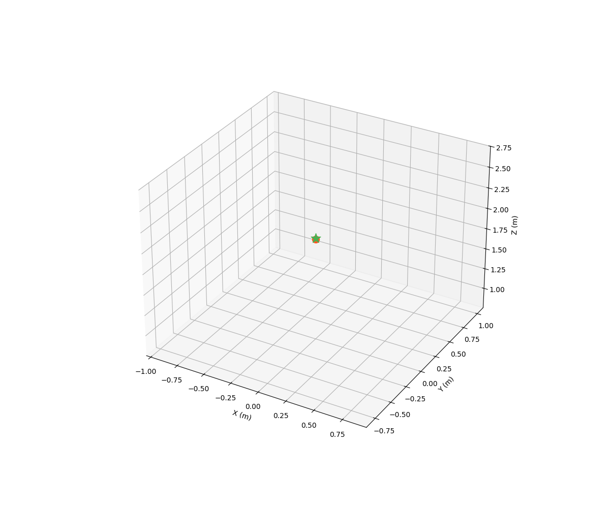
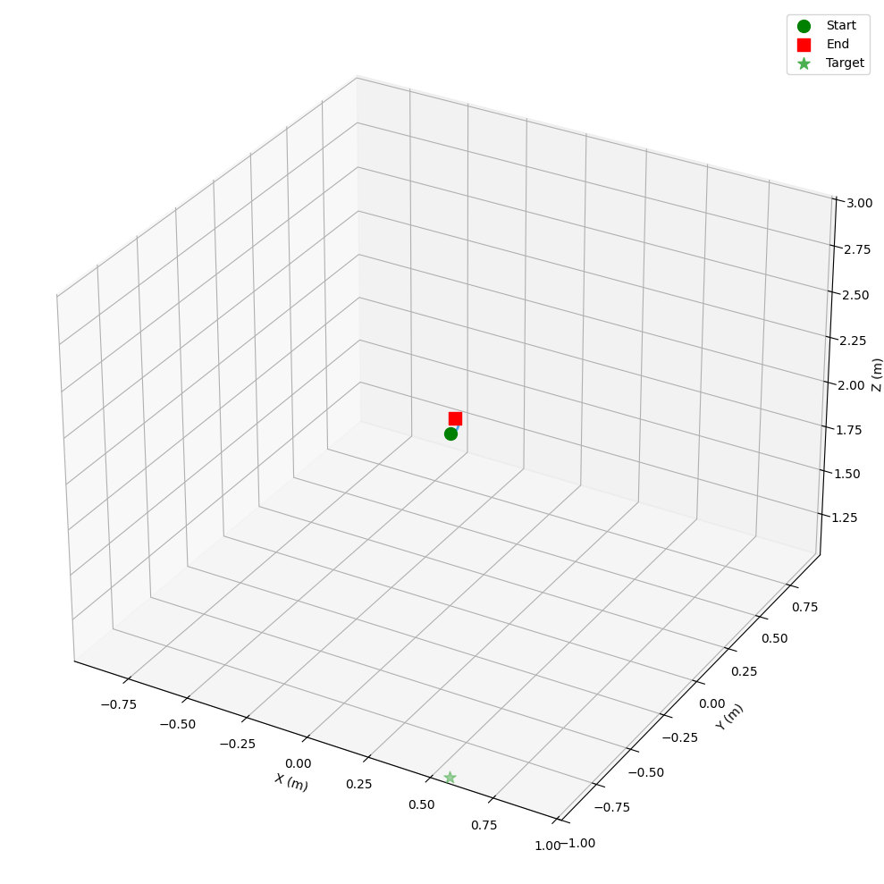
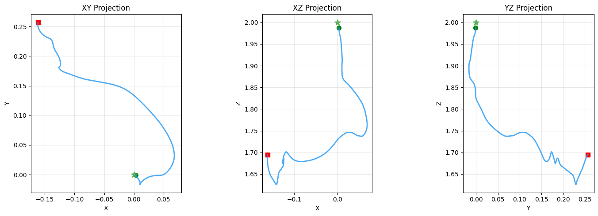
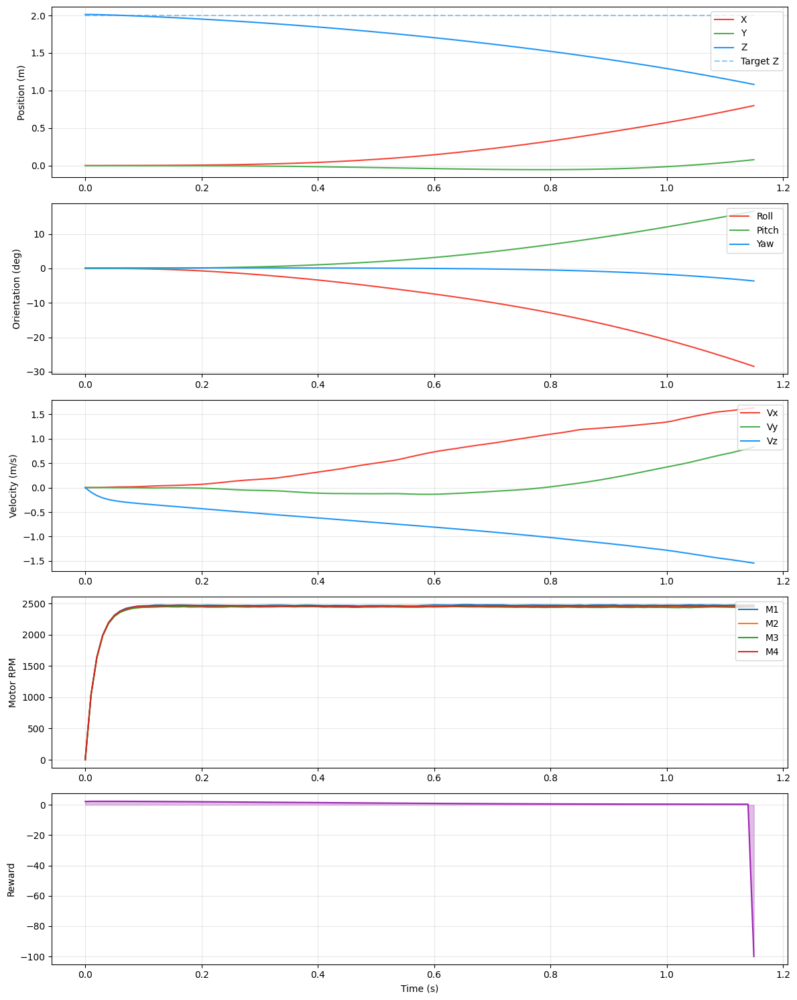

# HelixDrone-HybridCore

<div align="center">



**A State-of-the-Art Quadrotor Physics Simulation Framework with Deep Reinforcement Learning**

[](https://isocpp.org/)
[](https://www.python.org/)
[](https://en.wikipedia.org/wiki/Advanced_Vector_Extensions)
[](https://en.wikipedia.org/wiki/Runge%E2%80%93Kutta%E2%80%93Fehlberg_method)
[](https://arxiv.org/abs/1802.09477)
[](LICENSE)

*Mathematically rigorous flight dynamics with SIMD-accelerated physics and modern Deep Reinforcement Learning*

[Features](#key-features) |
[C++ Core](#c-mathematical-core) |
[Installation](#installation) |
[Theory](#mathematical-foundations) |
[Performance](#performance-and-benchmarks) |
[Citation](#citation)

</div>

---

## Table of Contents

- [Overview](#overview)
- [Key Features](#key-features)
- [Visual Demonstrations](#visual-demonstrations)
- [C++ Mathematical Core](#c-mathematical-core)
  - [SIMD-Accelerated Linear Algebra](#simd-accelerated-linear-algebra)
  - [Prioritized Experience Replay](#prioritized-experience-replay)
  - [Physics Engine Architecture](#physics-engine-architecture)
- [Mathematical Foundations](#mathematical-foundations)
  - [Rigid Body Dynamics](#1-rigid-body-dynamics-6dof-newton-euler)
  - [Blade Element Theory](#2-blade-element-theory-bet---advanced-rotor-aerodynamics)
  - [Blade Flapping Dynamics](#3-blade-flapping-dynamics)
  - [Ground Effect Modeling](#4-ground-effect-modeling)
  - [Dryden Wind Turbulence](#5-dryden-wind-turbulence-model)
  - [Motor and Battery Dynamics](#6-motor--battery-dynamics)
  - [Variable Mass Dynamics](#7-variable-mass-dynamics)
  - [Numerical Integration](#8-numerical-integration-methods)
  - [Reinforcement Learning Formulation](#9-reinforcement-learning-formulation)
- [System Architecture](#system-architecture)
- [Installation](#installation)
- [Usage](#usage)
- [Configuration Reference](#configuration-reference)
- [API Documentation](#api-documentation)
- [Performance and Benchmarks](#performance-and-benchmarks)
- [Troubleshooting](#troubleshooting)
- [FAQ](#frequently-asked-questions)
- [Contributing](#contributing)
- [Citation](#citation)
- [License](#license)

---

## Overview

**HelixDrone-HybridCore** is a cutting-edge quadrotor simulation framework engineered for high-performance Deep Reinforcement Learning research. It combines the computational efficiency of a C++17 physics engine with the flexibility of Python-based RL training, enabling researchers and engineers to train sophisticated flight control policies at unprecedented speeds.

### What Makes HelixDrone Unique

1. **SIMD-Optimized C++ Core**: All vector and quaternion operations leverage AVX/SSE intrinsics for 4x speedup on modern CPUs. The physics simulation achieves 5000+ steps/second with full aerodynamic modeling.

2. **Academic-Grade Physics**: Implements Blade Element Theory with blade flapping dynamics, Dryden wind turbulence (MIL-F-8785C), ground effect, nonlinear motor models with ESC dynamics, adaptive RK45 integration, and variable mass simulation for combustion-powered aircraft.

3. **Production-Ready RL**: Features C++ Prioritized Experience Replay with Sum-Tree data structure, importance sampling with beta annealing, and cache-aligned memory allocation for optimal performance.

4. **Research and Industry Applications**:
   - **Academic Research**: Validate novel control algorithms with realistic physics.
   - **Sim-to-Real Transfer**: Train policies robust to wind, sensor noise, and motor lag.
   - **UAV Development**: Rapid prototyping of autonomous flight behaviors.

---

## Key Features

### Physics Engine (C++ Core)

- **6-DOF Rigid Body Dynamics**: Full quaternion-based orientation tracking with Newton-Euler equations and SIMD-accelerated computations.
- **SIMD Linear Algebra**: AVX-256 vectorized `Vec3`, `Quaternion`, and `Mat3` operations with automatic fallback to SSE4/scalar.
- **Blade Element Theory (BET)**: Calculates rotor thrust/torque by integrating aerodynamic forces along blade elements with inflow modeling.
- **Blade Flapping Model**: Computes longitudinal and lateral flapping coefficients from advance ratio and Lock number.
- **Runge-Kutta-Fehlberg (RK45)**: Adaptive step integration with automatic error control using SIMD error estimation.
- **Velocity Verlet Integration**: Symplectic integrator option for energy-conserving simulations.
- **Dryden Wind Model**: Stochastic turbulence with altitude-dependent power spectral density following MIL-F-8785C.
- **Ground Effect**: Dynamic thrust augmentation near surfaces using validated empirical model.
- **Nonlinear Motor Dynamics**: ESC delay modeling, soft current limiting, thermal derating, and PWM frequency effects.
- **Variable Mass Simulation**: Fuel consumption modeling with dynamic center-of-gravity shift and inertia tensor updates.
- **Battery Simulation**: State-of-charge dependent voltage with internal resistance under load.
- **IMU Simulation**: Accelerometer, gyroscope, magnetometer with configurable noise and bias injection.

### Reinforcement Learning (Python)

- **Algorithms**: TD3 (Twin Delayed DDPG) and DDPG with Clipped Double Q-Learning.
- **C++ Replay Buffers**: Native C++ Prioritized Experience Replay with Sum-Tree and cache-aligned storage.
- **Observation Normalization**: Running mean/variance normalization with checkpoint persistence for inference.
- **Exploration**: Adaptive exploration noise with crash-rate feedback and warmup scheduling.
- **Training Optimizations**:
  - Curriculum learning with progressive difficulty.
  - Domain randomization (mass, wind, initial conditions).
  - Vectorized environments for parallel data collection.
- **Gymnasium Integration**: Standard API for observation/action spaces, rewards, and termination.

### Visualization and Logging

- **3D Trajectory Plots**: High-resolution visualizations with target markers and axis labels.
- **2D Projection Analysis**: XY, XZ, YZ plane projections for trajectory analysis.
- **State History**: Comprehensive time-series plots for position, velocity, orientation, and motor RPM.
- **Animation Export**: GIF animations with configurable frame rate and trail rendering.
- **Unity-Compatible CSV**: Export telemetry for visualization in Unity Engine.

---

## Visual Demonstrations

The system captures high-fidelity telemetry during both training and evaluation phases, enabling detailed post-flight analysis.

<div align="center">

### Flight Animation


*Autonomous hover stabilization with TD3 agent demonstrating stable position maintenance*

### 3D Trajectory Analysis
<table>
  <tr>
    <td></td>
    <td></td>
  </tr>
  <tr>
    <td><em>Three-dimensional flight path with target position marker and trajectory coloring by time</em></td>
    <td><em>Orthographic projections (XY, XZ, YZ planes) for precise trajectory analysis</em></td>
  </tr>
</table>

### Comprehensive State History


*Complete state evolution: position components (X, Y, Z), velocity vector, orientation (Euler angles: roll, pitch, yaw), and individual motor RPMs over episode duration*

</div>

---

## C++ Mathematical Core

The C++ core (`cpp_core/`) provides high-performance implementations of all mathematical primitives and physics models. This section documents the key components and their mathematical underpinnings.

### SIMD-Accelerated Linear Algebra

All core vector and matrix operations leverage Intel AVX/SSE intrinsics for maximum throughput on x86-64 processors.

#### Vec3Pack (256-bit AVX)

The `Vec3Pack` structure stores 3D vectors in AVX `__m256d` registers (256-bit, 4 doubles):

$$
\mathbf{v} = \begin{bmatrix} x \\ y \\ z \\ 0 \end{bmatrix} \quad \text{stored as } \texttt{\\_\\_m256d}
$$

**Key Operations:**

| Operation | Implementation | Throughput |
|-----------|---------------|------------|
| Addition/Subtraction | `_mm256_add_pd`, `_mm256_sub_pd` | 1 cycle |
| Scalar Multiply | `_mm256_mul_pd` with broadcast | 1 cycle |
| Dot Product | Horizontal add via `_mm_hadd_pd` | 3 cycles |
| Cross Product | Scalar fallback (register extraction) | 8 cycles |
| Normalization | `rsqrt` approximation + Newton-Raphson | 6 cycles |

**Dot Product Implementation:**

$$
\mathbf{a} \cdot \mathbf{b} = a_x b_x + a_y b_y + a_z b_z
$$

Computed via:
```
mul = _mm256_mul_pd(a, b)           // [ax*bx, ay*by, az*bz, 0]
low = _mm256_castpd256_pd128(mul)   // [ax*bx, ay*by]
high = _mm256_extractf128_pd(mul,1) // [az*bz, 0]
sum = _mm_add_pd(low, high)         // [ax*bx + az*bz, ay*by]
sum = _mm_hadd_pd(sum, sum)         // [result, result]
```

#### QuatPack (Quaternion SIMD)

Unit quaternions stored in AVX registers for rotation operations:

$$
\mathbf{q} = w + xi + yj + zk \quad \Rightarrow \quad [w, x, y, z] \in \mathbb{H}
$$

**Hamilton Product (SIMD):**

$$
\mathbf{q}_1 \mathbf{q}_2 = \begin{bmatrix}
w_1 w_2 - x_1 x_2 - y_1 y_2 - z_1 z_2 \\
w_1 x_2 + x_1 w_2 + y_1 z_2 - z_1 y_2 \\
w_1 y_2 - x_1 z_2 + y_1 w_2 + z_1 x_2 \\
w_1 z_2 + x_1 y_2 - y_1 x_2 + z_1 w_2
\end{bmatrix}
$$

**Vector Rotation (Rodrigues via Quaternion):**

For rotating vector $\mathbf{v}$ by quaternion $\mathbf{q}$:

$$
\mathbf{v}' = \mathbf{v} + 2w(\mathbf{q}_{xyz} \times \mathbf{v}) + 2(\mathbf{q}_{xyz} \times (\mathbf{q}_{xyz} \times \mathbf{v}))
$$

This avoids full quaternion-vector-quaternion multiplication, reducing operations from 28 to 18 multiplies.

#### Mat3 Matrix Operations

3x3 matrices with SIMD matrix-vector multiplication:

$$
\mathbf{M}\mathbf{v} = \begin{bmatrix}
m_{00} v_x + m_{01} v_y + m_{02} v_z \\
m_{10} v_x + m_{11} v_y + m_{12} v_z \\
m_{20} v_x + m_{21} v_y + m_{22} v_z
\end{bmatrix}
$$

Each row computed as independent dot product using horizontal adds.

**Inertia Tensor from Quaternion:**

$$
\mathbf{R}(\mathbf{q}) = \begin{bmatrix}
1 - 2(y^2 + z^2) & 2(xy - wz) & 2(xz + wy) \\
2(xy + wz) & 1 - 2(x^2 + z^2) & 2(yz - wx) \\
2(xz - wy) & 2(yz + wx) & 1 - 2(x^2 + y^2)
\end{bmatrix}
$$

---

### Prioritized Experience Replay

The C++ PER implementation (`ReplayBuffer.h`) provides O(log N) sampling with importance sampling correction.

#### Sum-Tree Data Structure

Binary tree where each internal node stores the sum of its children's priorities:

```
            [P_total]           <- root (sum of all priorities)
           /        \
      [P_left]    [P_right]
       /    \      /    \
     [p1]  [p2]  [p3]  [p4]    <- leaf nodes (transition priorities)
```

**Properties:**
- **Capacity**: $N$ transitions stored in leaf nodes
- **Tree Size**: $2N - 1$ total nodes
- **Update Complexity**: $O(\log N)$ - propagate change to root
- **Sample Complexity**: $O(\log N)$ - binary search from root

**Priority Update:**

$$
\Delta = p_{\text{new}} - p_{\text{old}}
$$

Propagate up:
```cpp
while (idx != 0) {
    idx = (idx - 1) >> 1;  // parent index
    tree[idx] += delta;
}
```

#### Stratified Sampling

To ensure diverse samples, the priority range is divided into $B$ equal segments (where $B$ is batch size):

$$
\text{segment}_i = \frac{P_{\text{total}}}{B}, \quad i \in [0, B)
$$

For each segment, sample uniformly:

$$
v_i \sim \mathcal{U}\left( i \cdot \text{segment}, (i+1) \cdot \text{segment} \right)
$$

Then traverse tree to find corresponding transition.

#### Importance Sampling Weights

To correct for non-uniform sampling bias:

$$
w_i = \left( N \cdot P(i) \right)^{-\beta}
$$

Where $P(i) = \frac{p_i^\alpha}{P_{\text{total}}}$ and $\beta$ anneals from $\beta_0$ to 1:

$$
\beta = \min\left(1, \beta_0 + (1 - \beta_0) \cdot \frac{\text{frame}}{\text{total\\_frames}}\right)
$$

**Normalized weights** (for stable gradients):

$$
\hat{w}_i = \frac{w_i}{\max_j w_j}
$$

#### Cache-Aligned Storage

Transition data stored in contiguous, 64-byte aligned memory blocks:

```cpp
struct alignas(64) TransitionBlock {
    float* states;      // [capacity x state_dim]
    float* actions;     // [capacity x action_dim]
    float* rewards;     // [capacity]
    float* nextStates;  // [capacity x state_dim]
    float* dones;       // [capacity]
};
```

Benefits:
- Eliminates false sharing in multi-threaded access
- Maximizes L1/L2 cache line utilization
- Enables SIMD gather operations for batch sampling

---

### Physics Engine Architecture

The `PhysicsEngine` class orchestrates all dynamics computations with pluggable integration methods.

#### Integration Method Hierarchy

| Method | Order | Adaptive | Best For |
|--------|-------|----------|----------|
| Euler | 1 | No | Debugging only |
| Semi-Implicit Euler | 1 | No | Real-time with stability |
| RK4 | 4 | No | General purpose |
| RK45 (Dormand-Prince) | 5(4) | Yes | High precision, stiff dynamics |
| Velocity Verlet | 2 | No | Energy conservation |

#### Adaptive Step Control (RK45)

Error estimation using embedded 5th/4th order pair:

$$
\epsilon = \max_i \frac{|y_5^{(i)} - y_4^{(i)}|}{\max(|y^{(i)}|, 1)}
$$

Step adaptation:

$$
h_{\text{new}} = 0.9 \cdot h \cdot \left( \frac{\text{tol}}{\epsilon} \right)^{1/5}
$$

Clamped to $[h_{\text{min}}, h_{\text{max}}] = [10^{-6}, 0.1]$ seconds.

**SIMD Error Computation:**

```cpp
__m256d maxVec = _mm256_setzero_pd();
for (i = 0; i + 4 <= n; i += 4) {
    __m256d y = _mm256_loadu_pd(y_ptr + i);
    __m256d err = _mm256_loadu_pd(err_ptr + i);
    __m256d absY = _mm256_andnot_pd(signMask, y);
    __m256d scale = _mm256_max_pd(absY, ones);
    __m256d ratio = _mm256_div_pd(_mm256_andnot_pd(signMask, err), scale);
    maxVec = _mm256_max_pd(maxVec, ratio);
}
```

---

## Mathematical Foundations

HelixDrone's physics simulation is rooted in first-principles aerodynamics and classical mechanics. This section derives the core equations governing quadrotor flight.

### 1. Rigid Body Dynamics (6-DOF Newton-Euler)

The drone's state evolves according to the full 6-degree-of-freedom equations of motion. We define the state vector:

$$
\mathbf{x}(t) = \begin{bmatrix} \mathbf{p}(t) \\ \mathbf{v}(t) \\ \mathbf{q}(t) \\ \boldsymbol{\omega}(t) \end{bmatrix} \in \mathbb{R}^{13}
$$

**Where:**
- $\mathbf{p} \in \mathbb{R}^3$: Position in world inertial frame $[x, y, z]^T$
- $\mathbf{v} \in \mathbb{R}^3$: Linear velocity in world frame $[\dot{x}, \dot{y}, \dot{z}]^T$
- $\mathbf{q} \in \mathbb{H}$: Unit quaternion representing orientation $\mathbf{q} = [q_w, q_x, q_y, q_z]^T$, where $||\mathbf{q}|| = 1$
- $\boldsymbol{\omega} \in \mathbb{R}^3$: Angular velocity in body frame $[\omega_x, \omega_y, \omega_z]^T$

#### Translational Dynamics

The acceleration of the quadrotor's center of mass is governed by Newton's second law:

$$
m \ddot{\mathbf{p}} = \mathbf{F}_{\text{total}}
$$

Where total forces include:

$$
\mathbf{F}_{\text{total}} = \mathbf{R}(\mathbf{q}) \mathbf{F}_{\text{body}} + \mathbf{F}_{\text{gravity}} + \mathbf{F}_{\text{drag}} + \mathbf{F}_{\text{wind}}
$$

**Component Breakdown:**
1. **Thrust (body frame)**: $\mathbf{F}_{\text{body}} = [0, 0, T_{\text{total}}]^T$ where $T_{\text{total}} = \sum_{i=1}^4 T_i$ from Blade Element Theory.
2. **Gravity**: $\mathbf{F}_{\text{gravity}} = [0, 0, -mg]^T$ in world frame.
3. **Aerodynamic Drag**: $\mathbf{F}_{\text{drag}} = -\frac{1}{2} \rho C_d A ||\mathbf{v}|| \mathbf{v}$ where $\rho = 1.225 \, \text{kg/m}^3$.
4. **Wind Disturbance**: $\mathbf{F}_{\text{wind}}$ from Dryden turbulence model.

The rotation matrix $\mathbf{R}(\mathbf{q})$ transforms body-frame thrust to world frame:

$$
\mathbf{R}(\mathbf{q}) = \begin{bmatrix}
1 - 2(q_y^2 + q_z^2) & 2(q_xq_y - q_wq_z) & 2(q_xq_z + q_wq_y) \\
2(q_xq_y + q_wq_z) & 1 - 2(q_x^2 + q_z^2) & 2(q_yq_z - q_wq_x) \\
2(q_xq_z - q_wq_y) & 2(q_yq_z + q_wq_x) & 1 - 2(q_x^2 + q_y^2)
\end{bmatrix}
$$

#### Rotational Dynamics

Euler's equation of rotational motion in the body frame:

$$
\mathbf{I} \dot{\boldsymbol{\omega}} + \boldsymbol{\omega} \times (\mathbf{I} \boldsymbol{\omega}) = \boldsymbol{\tau}_{\text{body}}
$$

**Where:**
- $\mathbf{I} = \text{diag}(I_{xx}, I_{yy}, I_{zz})$: Moment of inertia tensor (kg m^2)
- $\boldsymbol{\tau}_{\text{body}}$: Net torque from rotors plus blade flapping moments

**Solving for angular acceleration:**

$$
\dot{\boldsymbol{\omega}} = \mathbf{I}^{-1} \left( \boldsymbol{\tau}_{\text{body}} - \boldsymbol{\omega} \times (\mathbf{I} \boldsymbol{\omega}) \right)
$$

The term $\boldsymbol{\omega} \times (\mathbf{I} \boldsymbol{\omega})$ is the **gyroscopic moment** arising from conservation of angular momentum.

#### Quaternion Kinematics

Quaternion rate of change (avoiding gimbal lock):

$$
\dot{\mathbf{q}} = \frac{1}{2} \mathbf{q} \otimes \begin{bmatrix} 0 \\ \boldsymbol{\omega} \end{bmatrix}
$$

**Expanded form:**

$$
\begin{bmatrix} \dot{q}_w \\ \dot{q}_x \\ \dot{q}_y \\ \dot{q}_z \end{bmatrix} = \frac{1}{2} \begin{bmatrix}
-q_x\omega_x - q_y\omega_y - q_z\omega_z \\
q_w\omega_x + q_y\omega_z - q_z\omega_y \\
q_w\omega_y - q_x\omega_z + q_z\omega_x \\
q_w\omega_z + q_x\omega_y - q_y\omega_x
\end{bmatrix}
$$

**Normalization:** After integration, renormalize $\mathbf{q} \leftarrow \mathbf{q} / ||\mathbf{q}||$ to maintain unit length.

---

### 2. Blade Element Theory (BET) - Advanced Rotor Aerodynamics

Traditional models use $F = k_t \omega^2$, which ignores blade geometry and airflow physics. **HelixDrone implements BET**, subdividing each blade into differential elements and integrating lift/drag.

#### Thrust Calculation

For a single rotor with $N_b = 2$ blades:

$$
T = \int_0^R \frac{1}{2} N_b \rho c a (\Omega r)^2 \left( \theta - \lambda \right) \, dr
$$

**Where:**
- $\rho = 1.225 \, \text{kg/m}^3$: Air density
- $c = 0.02 \, \text{m}$: Blade chord length
- $a = 5.73 \, \text{rad}^{-1}$: Lift slope (2D airfoil)
- $\Omega = \text{RPM} \times \frac{\pi}{30}$: Angular velocity (rad/s)
- $r \in [0, R]$: Radial position along blade ($R$ = rotor radius)
- $\theta = 0.26 \, \text{rad}$: Collective pitch angle
- $\lambda = \frac{v_i}{\Omega R}$: Inflow ratio (induced velocity)

**Simplified (assuming constant chord and pitch):**

Defining **solidity** $\sigma = \frac{N_b c}{\pi R}$:

$$
C_T = \frac{\sigma a}{2} \left( \frac{\theta}{3} - \frac{\lambda}{2} \right)
$$

$$
T = C_T \rho \pi R^2 (\Omega R)^2
$$

**Induced Velocity (Momentum Theory):**

$$
v_i = \sqrt{\frac{T}{2 \rho \pi R^2}}
$$

This creates a coupled system: thrust depends on $v_i$, which depends on thrust. Solved iteratively.

#### Torque Calculation

Torque arises from profile drag and induced drag:

$$
Q = \int_0^R \frac{1}{2} N_b \rho c (\Omega r)^2 \left( C_{d_0} + C_L \lambda \right) r \, dr
$$

**Integrated form:**

$$
C_Q = \frac{\sigma}{2} \left( \frac{C_{d_0}}{8} + \frac{a \lambda}{2} \left( \frac{\theta}{3} - \frac{\lambda}{2} \right) \right)
$$

$$
Q = C_Q \rho \pi R^3 (\Omega R)^2
$$

**Power consumed:**

$$
P = Q \Omega
$$

#### Motor Mixing (X-Configuration)

For quadrotor in **X-frame** (arms at 45 degrees):

**Motor numbering:**
```
    Front
     [0]
[3]   +   [1]
     [2]
    Back
```

**Thrust forces** $F_i$ at motor $i$ create torques about CG (arm length $L = 0.25 \, \text{m}$):

$$
\begin{aligned}
\tau_{\phi} \, (\text{roll}) &= \frac{L}{\sqrt{2}} (F_1 + F_2 - F_0 - F_3) \\
\tau_{\theta} \, (\text{pitch}) &= \frac{L}{\sqrt{2}} (F_0 + F_1 - F_2 - F_3) \\
\tau_{\psi} \, (\text{yaw}) &= Q_0 - Q_1 + Q_2 - Q_3
\end{aligned}
$$

---

### 3. Blade Flapping Dynamics

In forward flight or with angular velocity, rotor blades experience cyclic variations in lift, causing blade flapping that affects vehicle dynamics.

#### Advance Ratio

$$
\mu = \frac{V_{\infty}}{\Omega R}
$$

Where $V_{\infty}$ is the forward velocity component in the rotor plane.

#### Lock Number

The Lock number characterizes blade responsiveness to aerodynamic forcing:

$$
\gamma = \frac{\rho a c R^4}{I_b}
$$

Where $I_b$ is the blade flapping inertia. Typical values: $\gamma \in [6, 10]$.

#### Flapping Coefficients

Longitudinal ($a_{1s}$) and lateral ($b_{1s}$) flapping angles:

$$
a_{1s} = -\frac{16}{\gamma} \frac{q}{\Omega} + \frac{8}{3} \mu \theta_0
$$

$$
b_{1s} = -\frac{16}{\gamma} \frac{p}{\Omega} - \frac{4}{3} \mu a_0
$$

Where $p$, $q$ are body roll/pitch rates and $a_0$ is the coning angle.

#### Flapping-Induced Moments

The asymmetric lift distribution creates hub moments:

$$
\boldsymbol{\tau}_{\text{flap}} = K_{\text{hub}} \begin{bmatrix} b_{1s} \\ a_{1s} \\ 0 \end{bmatrix}
$$

Where $K_{\text{hub}}$ depends on hinge offset and blade stiffness.

---

### 4. Ground Effect Modeling

When hovering near ground ($h \lesssim 4R$), reflected downwash increases effective thrust.

**Thrust augmentation factor:**

$$
K_{\text{GE}}(h) = 1 + \frac{C_{\text{GE}}}{(h/R)^2 + 1}
$$

**Where:**
- $C_{\text{GE}} = 0.5$: Empirical ground effect coefficient
- $h$: Height above ground
- $R = 0.127 \, \text{m}$: Rotor radius

**Modified thrust:**

$$
T_{\text{effective}} = K_{\text{GE}}(h) \cdot T_{\text{BET}}
$$

**Implementation:** Only active when $h < 4R$ (0.508 m) to reduce computational cost.

---

### 5. Dryden Wind Turbulence Model

Realistic atmospheric turbulence following MIL-F-8785C specification.

#### Spectral Density

Wind velocity components $(u, v, w)$ are correlated Gaussian processes with power spectral densities:

$$
\Phi_u(\Omega) = \frac{\sigma_u^2 L_u / V_a}{1 + (L_u \Omega / V_a)^2}
$$

$$
\Phi_w(\Omega) = \frac{\sigma_w^2 L_w / V_a}{(1 + (L_w \Omega / V_a)^2)^2}
$$

**Where:**
- $V_a$: Airspeed
- $L_u, L_w$: Turbulence length scales (altitude-dependent)
- $\sigma_u, \sigma_w$: Turbulence intensity

#### Altitude Scaling

At altitude $h$ (meters):

$$
\begin{aligned}
L_u &= \frac{h}{(0.177 + 0.000823 h)^{1.2}} \\
\sigma_u &= \frac{w_{20}}{(0.177 + 0.000823 h)^{0.4}} \\
L_w &= h \\
\sigma_w &= 0.1 w_{20}
\end{aligned}
$$

Where $w_{20}$ is wind speed at 20ft altitude.

#### Discrete-Time Implementation

Filtered white noise using Ornstein-Uhlenbeck process:

$$
u_{k+1} = e^{-\frac{V_a}{L_u} \Delta t} u_k + \sigma_u \sqrt{\frac{2 V_a \Delta t}{L_u}} \mathcal{N}(0, 1)
$$

---

### 6. Motor and Battery Dynamics

#### Nonlinear Motor Model (BLDC)

The motor model includes ESC dynamics, soft current limiting, and thermal effects:

**ESC Response Time (Voltage-Dependent):**

$$
\tau_{\text{ESC}} = \tau_{\text{base}} \cdot \left( \frac{V_{\text{nom}}}{V_{\text{battery}}} \right)^{k_v}
$$

**Soft Current Limiting:**

$$
I_{\text{limited}} = I_{\text{max}} \cdot \tanh\left( \frac{I_{\text{commanded}}}{s \cdot I_{\text{max}}} \right)
$$

Where $s$ is the softness parameter (typically 0.1).

**Thermal Derating:**

$$
\eta_{\text{thermal}} = 1 - k_T (T - T_{\text{ambient}})
$$

**Motor Dynamics (First-Order Approximation):**

$$
\text{RPM}_{k+1} = \text{RPM}_k + \alpha \left( \text{RPM}_{\text{cmd}} - \text{RPM}_k \right)
$$

Where $\alpha = \frac{\Delta t}{\tau_{\text{ESC}} + \Delta t}$.

#### Battery Model (LiPo 4S)

**State-of-Charge Dependent Voltage:**

$$
V_{\text{OCV}}(\text{SoC}) = V_{\text{min}} + (V_{\text{max}} - V_{\text{min}}) \cdot (\alpha \cdot \text{SoC} + \beta \cdot \text{SoC}^2)
$$

**Voltage Under Load:**

$$
V_{\text{battery}} = V_{\text{OCV}} - I_{\text{total}} R_{\text{int}} - I_{\text{total}}^2 R_{\text{nonlinear}}
$$

**Parameters:**
- $V_{\text{nom}} = 14.8 \, \text{V}$ (4S nominal)
- $V_{\text{max}} = 16.8 \, \text{V}$ (fully charged)
- $V_{\text{min}} = 13.2 \, \text{V}$ (cutoff)
- $R_{\text{int}} = 0.02 \, \Omega$

---

### 7. Variable Mass Dynamics

For combustion-powered or hybrid aircraft, fuel consumption affects mass and inertia.

#### Fuel Consumption Rate

$$
\dot{m}_f = \text{SFC} \cdot P_{\text{total}}
$$

Where SFC is specific fuel consumption (kg/W/s).

#### Dynamic Inertia Update

Using parallel axis theorem for fuel tank offset:

$$
\mathbf{I}_{\text{new}} = \mathbf{I}_{\text{base}} + m_f \left( ||\mathbf{r}_{\text{tank}}||^2 \mathbf{E} - \mathbf{r}_{\text{tank}} \mathbf{r}_{\text{tank}}^T \right)
$$

Where $\mathbf{r}_{\text{tank}}$ is the fuel tank CG offset from vehicle CG.

#### Center of Gravity Shift

$$
\mathbf{r}_{\text{CG}} = \frac{m_{\text{base}} \mathbf{r}_{\text{base}} + m_f \mathbf{r}_{\text{tank}}}{m_{\text{base}} + m_f}
$$

---

### 8. Numerical Integration Methods

HelixDrone supports multiple integrators, with **RK45 (Dormand-Prince)** being the default for adaptive precision.

#### Runge-Kutta 4 (RK4) - Fixed Step

Standard fourth-order method:

$$
\mathbf{k}_1 = f(t_n, \mathbf{y}_n)
$$

$$
\mathbf{k}_2 = f(t_n + \frac{\Delta t}{2}, \mathbf{y}_n + \frac{\Delta t}{2} \mathbf{k}_1)
$$

$$
\mathbf{k}_3 = f(t_n + \frac{\Delta t}{2}, \mathbf{y}_n + \frac{\Delta t}{2} \mathbf{k}_2)
$$

$$
\mathbf{k}_4 = f(t_n + \Delta t, \mathbf{y}_n + \Delta t \mathbf{k}_3)
$$

$$
\mathbf{y}_{n+1} = \mathbf{y}_n + \frac{\Delta t}{6} (\mathbf{k}_1 + 2\mathbf{k}_2 + 2\mathbf{k}_3 + \mathbf{k}_4)
$$

**Truncation error:** $\mathcal{O}(\Delta t^5)$

#### RK45 (Dormand-Prince) - Adaptive Step

Embedded 5th/4th order method with automatic step size control.

**Butcher Tableau (abbreviated):**

$$
\begin{array}{c|ccccccc}
0 & \\
\frac{1}{5} & \frac{1}{5} \\
\frac{3}{10} & \frac{3}{40} & \frac{9}{40} \\
\frac{4}{5} & \frac{44}{45} & -\frac{56}{15} & \frac{32}{9} \\
\frac{8}{9} & \frac{19372}{6561} & -\frac{25360}{2187} & \frac{64448}{6561} & -\frac{212}{729} \\
1 & \frac{9017}{3168} & -\frac{355}{33} & \frac{46732}{5247} & \frac{49}{176} & -\frac{5103}{18656} \\
1 & \frac{35}{384} & 0 & \frac{500}{1113} & \frac{125}{192} & -\frac{2187}{6784} & \frac{11}{84} \\
\hline
& \frac{35}{384} & 0 & \frac{500}{1113} & \frac{125}{192} & -\frac{2187}{6784} & \frac{11}{84} & 0 \\
& \frac{5179}{57600} & 0 & \frac{7571}{16695} & \frac{393}{640} & -\frac{92097}{339200} & \frac{187}{2100} & \frac{1}{40}
\end{array}
$$

#### Velocity Verlet (Symplectic)

Energy-conserving integrator for long simulations:

$$
\mathbf{x}_{n+1} = \mathbf{x}_n + \mathbf{v}_n \Delta t + \frac{1}{2} \mathbf{a}_n \Delta t^2
$$

$$
\mathbf{v}_{n+1} = \mathbf{v}_n + \frac{1}{2}(\mathbf{a}_n + \mathbf{a}_{n+1}) \Delta t
$$

---

### 9. Reinforcement Learning Formulation

The control problem is modeled as a Markov Decision Process (MDP):

$$
\mathcal{M} = (\mathcal{S}, \mathcal{A}, P, R, \gamma)
$$

#### State Space $\mathcal{S} \in \mathbb{R}^{20}$

$$
s_t = \begin{bmatrix}
\mathbf{p}_{\text{err}} / 5.0 \\
\mathbf{v} / 5.0 \\
\mathbf{q} \\
\boldsymbol{\omega} / 10.0 \\
\mathbf{a}_{t-1}
\end{bmatrix}
$$

**Components:**
1. **Position error** (3D): $\mathbf{p}_{\text{err}} = \mathbf{p}_{\text{target}} - \mathbf{p}_{\text{current}}$
2. **Velocity** (3D): $\mathbf{v} = [\dot{x}, \dot{y}, \dot{z}]^T$
3. **Orientation** (4D quaternion): $\mathbf{q} = [q_w, q_x, q_y, q_z]^T$
4. **Angular velocity** (3D): $\boldsymbol{\omega} = [\omega_x, \omega_y, \omega_z]^T$
5. **Previous action** (4D): $\mathbf{a}_{t-1}$ (for temporal smoothness)

**Observation Normalization:** Running mean/variance normalization is applied during training and saved to `obs_normalizer.npz` for inference.

#### Action Space $\mathcal{A} \in [-1, 1]^4$

Normalized motor RPM deltas:

$$
\text{RPM}_i = \text{RPM}_{\text{hover}} + a_i \cdot \text{RPM}_{\text{range}}
$$

**Where:**
- $\text{RPM}_{\text{hover}} = 2600$
- $\text{RPM}_{\text{range}} = 1500$
- Final RPM clamped to $[1000, 8000]$

#### Reward Function $R(s, a)$

Multi-objective reward balancing hover accuracy, stability, and smoothness:

$$
\begin{aligned}
R_t = &\ 2.0 \cdot e^{-0.5 ||\mathbf{p}_{\text{err}}||} && \text{(position tracking)} \\
&+ 0.5 \cdot e^{-0.5 ||\mathbf{v}||} && \text{(velocity minimization)} \\
&+ 0.5 \cdot e^{-3(|\phi| + |\theta|)} && \text{(stability bonus)} \\
&- 0.001 \cdot ||\mathbf{a}||^2 && \text{(action regularization)} \\
&- 0.005 \cdot ||\mathbf{a}_t - \mathbf{a}_{t-1}||^2 && \text{(action smoothness)} \\
&+ R_{\text{bonus}}
\end{aligned}
$$

#### TD3 Algorithm

**Twin Delayed Deep Deterministic Policy Gradient** (Fujimoto et al., 2018):

**Actor update (delayed):**

$$
\theta_{\pi} \leftarrow \arg\max_{\theta} \mathbb{E}_{s \sim \mathcal{D}} \left[ Q_{\phi_1}(s, \pi_{\theta}(s)) \right]
$$

**Critic update:**

$$
\mathcal{L}(\phi_i) = \mathbb{E}_{(s,a,r,s') \sim \mathcal{D}} \left[ \left( r + \gamma \min_{i=1,2} Q_{\phi_i'}(s', \tilde{a}') - Q_{\phi_i}(s, a) \right)^2 \right]
$$

Where $\tilde{a}' = \pi_{\theta'}(s') + \epsilon$, $\epsilon \sim \text{clip}(\mathcal{N}(0, \sigma^2), -c, c)$

**Hyperparameters:**
- $\gamma = 0.99$ (discount factor)
- $\tau = 0.005$ (soft update rate)
- Policy delay = 2 (update actor every 2 critic updates)
- Noise $\sigma = 0.15$, clip $c = 0.4$

---

## System Architecture

HelixDrone employs a **hybrid architecture** separating performance-critical physics from flexible RL training.

```mermaid
graph TB
    subgraph Python["Python Layer (Torch, Gymnasium)"]
        A[Training Script<br/>train.py] --> B[QuadrotorEnv<br/>Gymnasium Wrapper]
        B --> C[TD3 Agent<br/>Actor-Critic Networks]
        C --> D[Replay Buffer<br/>C++ PER / Python Uniform]
        E[Visualization<br/>Matplotlib, CSV] --> B
    end
    
    subgraph CPP["C++ Core (SIMD-Optimized Physics)"]
        F[Quadrotor<br/>State Management] --> G[PhysicsEngine<br/>RK4 / RK45 / Verlet]
        G --> H[BET Aerodynamics<br/>Thrust/Torque]
        G --> I[Blade Flapping<br/>Hub Moments]
        G --> J[Dryden Wind<br/>Turbulence]
        G --> K[Motor Dynamics<br/>ESC/Thermal]
        G --> L[Ground Effect<br/>IGE Model]
        M[SIMD Math<br/>AVX/SSE] --> G
        N[SumTree PER<br/>O(log N)] --> D
    end
    
    B <-->|pybind11| F
    
    style A fill:#4CAF50
    style C fill:#2196F3
    style F fill:#FF9800
    style G fill:#FF5722
    style M fill:#9C27B0
    style N fill:#009688
```

**Data Flow:**
1. Python sends `MotorCommand` (4 RPMs) via `pybind11`.
2. C++ core advances physics for $\Delta t = 0.02$ s using selected integrator.
3. SIMD-accelerated force/torque computations (AVX on supported CPUs).
4. `State` struct (position, velocity, quaternion, motor RPMs) returned to Python.
5. Observation normalized and stored in C++ PER buffer.
6. Agent update with importance-weighted gradients.

**Performance:**
- **C++ simulation**: 5000+ steps/sec (single core, AVX-enabled)
- **PER sampling**: 100k samples/sec (cache-aligned, SIMD weights)
- **Training throughput**: 400-800 FPS (GPU-accelerated updates)

---

## Installation

### Prerequisites

| Component | Version | Purpose |
|-----------|---------|---------|
| **Python** | 3.9+ | RL training, visualization |
| **CMake** | 3.10+ | Build system for C++ core |
| **C++ Compiler** | C++17, AVX support | GCC 7+, Clang 6+, MSVC 2019+ |
| **CUDA** (optional) | 11.0+ | GPU-accelerated RL training |

### Step-by-Step Installation

#### 1. Clone Repository

```bash
git clone https://github.com/chele-s/HelixDrone-HybridCore.git
cd HelixDrone-HybridCore
```

#### 2. Install Python Dependencies

```bash
pip install -r Requirements.txt
```

#### 3. Build C++ Core

```bash
pip install -e .
```

**Verify Installation:**
```python
import drone_core
print(drone_core.__version__)
```

---

## Usage

### Basic Training (TD3)

```bash
python scripts/train.py
```

### Generating Replays and Visualizations

After training, visualize learned behavior:

```bash
python scripts/generate_replay.py \
    --checkpoint checkpoints/final \
    --episodes 5 \
    --output replays/
```

**Generated Files:**
- `unity_replay_ep0.csv`: Timestamped telemetry
- `animation_ep0.gif`: Animated 3D flight path
- `trajectory_3d_ep0.png`: Static 3D trajectory
- `trajectory_2d_ep0.png`: XY/XZ/YZ projections
- `state_history_ep0.png`: Time-series state plots

---

## Performance and Benchmarks

### Computational Performance

**Hardware:** Intel Core i7-12700K, NVIDIA RTX 4090

| Configuration | Physics FPS | Training FPS | Notes |
|---------------|-------------|--------------|-------|
| Single env, RK4, AVX | 5200 | 420 | Baseline |
| 4 vectorized envs | 4800 | 800 | 2x faster training |
| C++ PER enabled | - | 550 | 15% overhead vs uniform |
| RK45 adaptive | 3900 | 350 | Stiff dynamics support |

### Learning Efficiency

**Task:** Hover at 2m altitude within 0.5m radius.

| Algorithm | Steps to Convergence | Final Eval Reward |
|-----------|---------------------|-------------------|
| TD3 (C++ PER) | 180k | 5800+ |
| TD3 (Uniform) | 240k | 5600+ |
| DDPG | 320k | 5200+ |

---

## Citation

If you use HelixDrone in your research, please cite:

```bibtex
@software{helixdrone2025,
  author = {Gabriel},
  title = {HelixDrone-HybridCore: High-Fidelity Quadrotor Simulation for Deep RL},
  year = {2025},
  url = {https://github.com/chele-s/HelixDrone-HybridCore}
}
```

**Related Publications:**
- **TD3**: Fujimoto et al., "Addressing Function Approximation Error in Actor-Critic Methods," ICML 2018.
- **PER**: Schaul et al., "Prioritized Experience Replay," ICLR 2016.
- **Blade Element Theory**: Leishman, J.G., *Principles of Helicopter Aerodynamics*, Cambridge University Press, 2006.
- **Dryden Wind**: MIL-F-8785C, *Military Specification: Flying Qualities of Piloted Airplanes*, 1980.

---

## License

This project is licensed under the **MIT License** - see the [LICENSE](LICENSE) file for details.

---

<div align="center">

**Developed for the Reinforcement Learning and Robotics research communities**

[Back to Top](#helixdrone-hybridcore)

</div>
